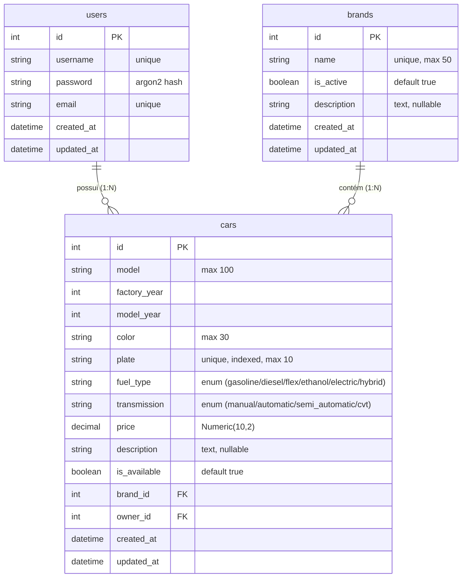
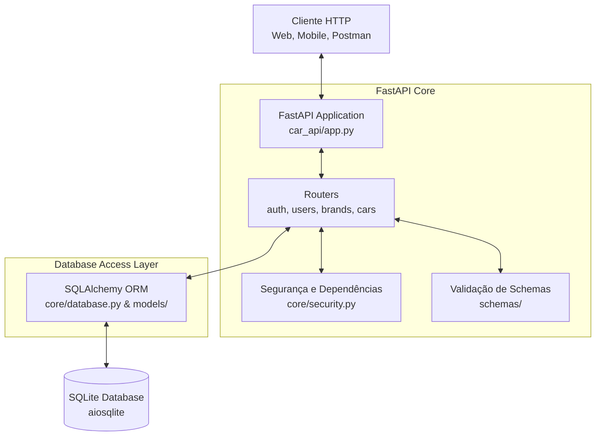
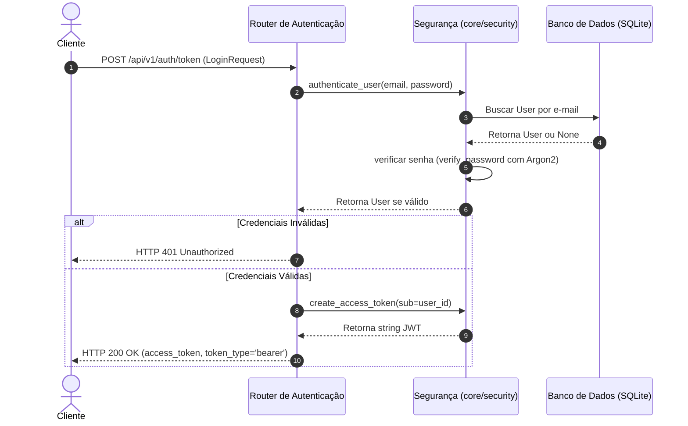
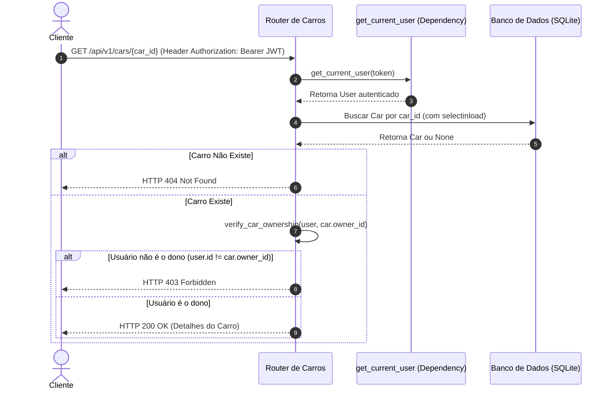
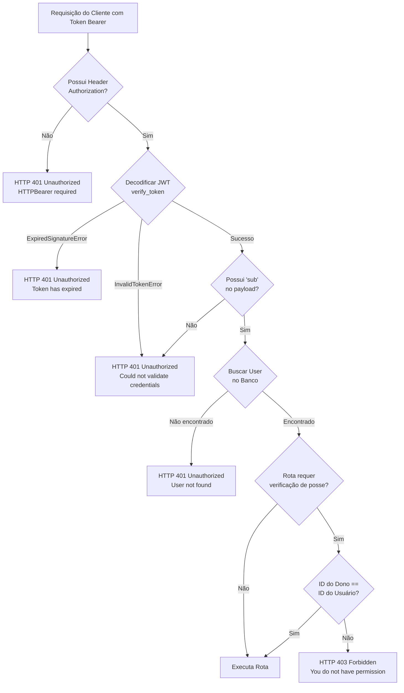

# Modelagem do Sistema 📊

Esta página apresenta os modelos visuais da **Car API** mapeando as entidades, a estrutura arquitetural e os principais fluxos de processamento do sistema.

---

## 🗄️ Modelos de Dados (ERD)

O diagrama abaixo ilustra as tabelas do banco de dados (geradas pelas classes SQLAlchemy em [models](file:///home/chris/Documents/car_api/car_api/models)), suas colunas, chaves primárias/estrangeiras e os relacionamentos.

---

## 🏛️ Arquitetura do Sistema

A API segue uma arquitetura em camadas estruturada em torno do ecossistema FastAPI e SQLAlchemy, mapeada a seguir:

---

## 🔐 Fluxo de Autenticação

Fluxo de requisição para obter o token de acesso (login) e renová-lo (refresh) usando JWT.

---

## 🚗 Fluxo CRUD de Carros (Autorização)

Abaixo está exemplificado o fluxo de leitura detalhada de um carro (`GET /cars/{id}`), ilustrando a validação de permissões realizada para certificar que o usuário solicitante é o dono do recurso.

---

## 🛡️ Fluxo de Segurança (Validação de Token)

Este diagrama representa a esteira de validação efetuada em todas as rotas protegidas pelo sistema antes de liberar o processamento da rota final.

